# 🌱 AgroAssist

**AgroAssist** is an AI-powered farming and farm-to-table marketplace app that helps farmers make smart crop decisions, track plant growth, and sell directly to consumers — all from a single React Native mobile app.

This repository contains **both the mobile app (frontend) and the API server (backend)** as separate, independently runnable projects.

---

## 📦 Repository Layout

```
AgroAssist/
├── frontend/      # 📱 React Native + Expo mobile app (Farmer + Consumer)
│   └── README.md  # frontend-specific setup
│
└── backend/       # 🖥️ Node.js + Express REST API + MongoDB + Gemini AI
    └── README.md  # backend-specific setup
```

| Folder | What it is | Read more |
|--------|-----------|-----------|
| [`frontend/`](./frontend) | React Native mobile app (farmer + consumer UI) | [frontend/README.md](./frontend/README.md) |
| [`backend/`](./backend)   | Node.js/Express API server + MongoDB + Gemini AI | [backend/README.md](./backend/README.md) |

---

## ✨ Features

### For Farmers
- 📱 **Phone-based OTP login** via Twilio + JWT session persistence
- 🌾 **AI Crop Recommendation** — GPS-based suggestions powered by Google Gemini 2.5 Flash
- 📈 **Growth Tracker** — stage-by-stage plant progress with manual override
- 🪴 **My Plants** — track multiple crops with shared growth cycle data
- 💰 **Marketplace** — list produce with photos, price, and quantity
- 📦 **Order Management** — live order lifecycle (pending → accepted → preparing → ready → picked up)
- 🌤️ **Dashboard** — weather, soil, and plant summary with Lottie animations

### For Consumers
- 🛒 **Browse farms** and nearby produce
- 🧺 **Farm-scoped cart** with direct checkout
- 🚚 **Order tracking** with live status timeline
- 📜 **Order history** (Active / Past tabs)

---

## 🛠️ Tech Stack

| Part | Tech |
|------|------|
| **Frontend** | React Native 0.83, Expo SDK 55, React Navigation, Lottie, react-native-svg, AsyncStorage |
| **Backend**  | Node.js, Express.js 5, MongoDB, Mongoose |
| **AI**       | Google Gemini 2.5 Flash |
| **Auth**     | Twilio SMS OTP + JWT |
| **Location** | expo-location (GPS) |

---

## 📸 Screenshots

<!-- Replace these placeholders with actual screenshots.
     Put images in: frontend/assets/screenshots/
     Recommended size: 250-300px wide each. -->

<table>
  <tr>
    <td align="center"><b>Login / OTP</b></td>
    <td align="center"><b>Farmer Dashboard</b></td>
    <td align="center"><b>Crop Recommendation</b></td>
  </tr>
  <tr>
    <td>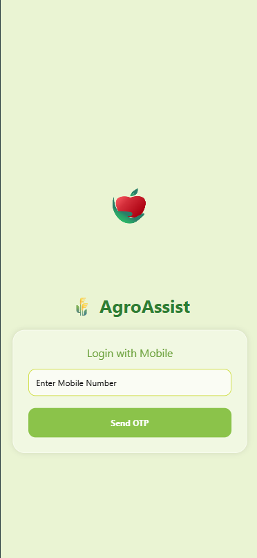</td>
    <td>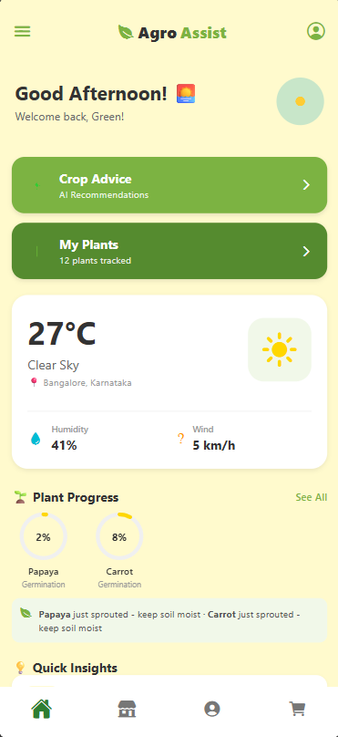</td>
    <td>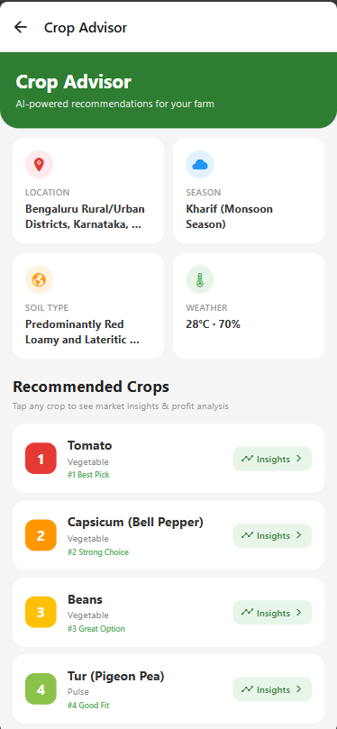</td>
  </tr>
  <tr>
    <td align="center"><b>My Plants</b></td>
    <td align="center"><b>Growth Tracker</b></td>
    <td align="center"><b>Add Plant</b></td>
  </tr>
  <tr>
    <td>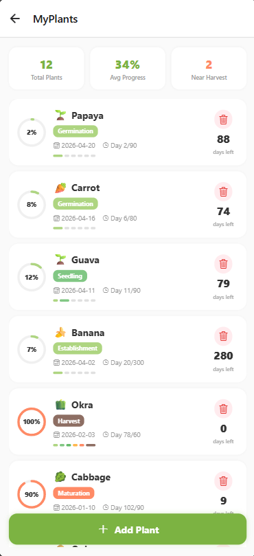</td>
    <td>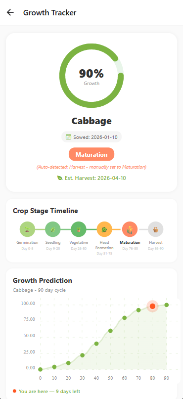</td>
    <td>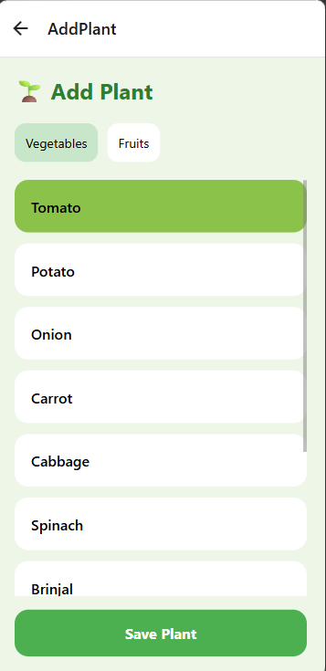</td>
  </tr>
  <tr>
    <td align="center"><b>Farmer Marketplace</b></td>
    <td align="center"><b>Farmer Orders</b></td>
    <td align="center"><b>Farm Profile</b></td>
  </tr>
  <tr>
    <td>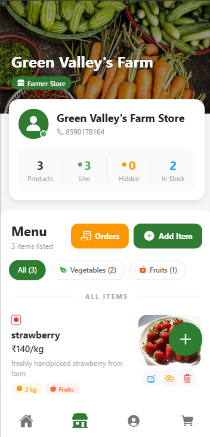</td>
    <td>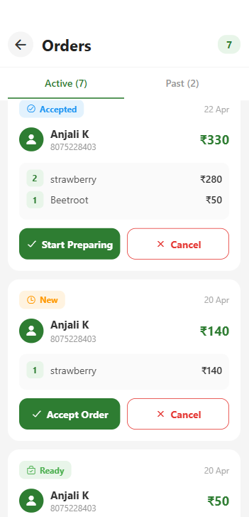</td>
    <td>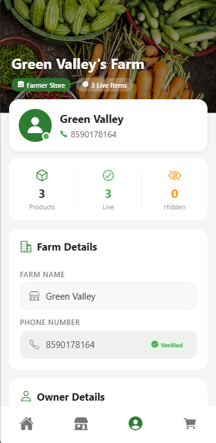</td>
  </tr>
  <tr>
    <td align="center"><b>Consumer Marketplace</b></td>
    <td align="center"><b>Cart</b></td>
    <td align="center"><b>Consumer Orders</b></td>
  </tr>
  <tr>
    <td>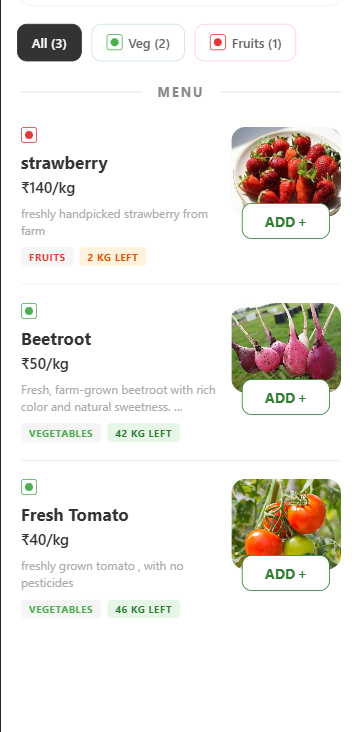</td>
    <td>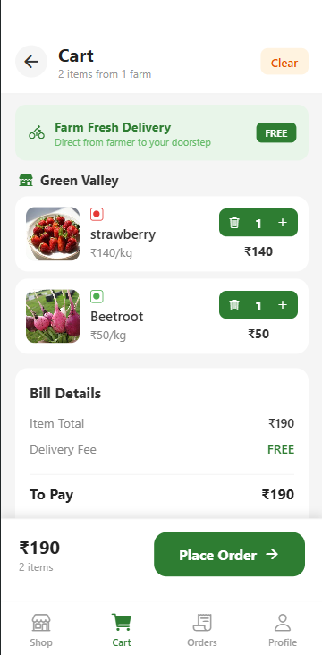</td>
    <td>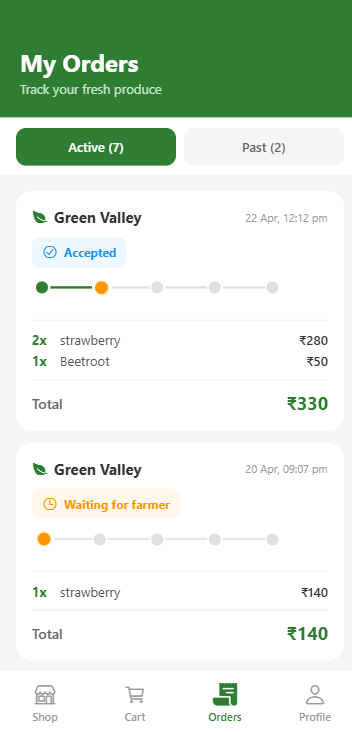</td>
  </tr>
</table>

---

## 🚀 Quick Start

### Prerequisites
- **Node.js** 18+ and **npm**
- **MongoDB** running locally (or a cloud URI)
- **Expo Go** app on your phone OR an Android/iOS emulator
- **Twilio** account (free trial works)
- **Google Gemini API key** — https://ai.google.dev/

### 1. Clone
```bash
git clone https://github.com/anjalik06/AgroAssist.git
cd AgroAssist
```

### 2. Start the backend
```bash
cd backend
npm install
cp .env.example .env      # then edit with your real credentials
npm start
```
Backend runs on `http://localhost:5000` by default.

### 3. Start the frontend
Open a new terminal:
```bash
cd frontend
npm install
cp .env.example .env      # set API_BASE_URL to your LAN IP:5000
npx expo start
```
Scan the QR code with Expo Go (Android) or Camera (iOS).

> ⚠️ In `frontend/.env` use your machine's LAN IP (e.g. `192.168.1.5`), **not** `localhost` — Expo Go on a phone cannot reach `localhost` on your laptop.

---

## 🧠 How the AI Recommendation Works

1. Mobile app captures GPS `(lat, lng)` via `expo-location`.
2. Backend rounds coordinates to 3 decimals (~100 m precision).
3. Looks up cached recommendation in MongoDB `Recommendation` collection for today.
4. **Cache hit** → returns immediately (zero API cost).
5. **Cache miss** → single structured prompt to **Gemini 2.5 Flash**, which returns:
   - Location, season, soil type, weather
   - Top 5 crops ranked by `trending_score`
   - 5-year price history, profit potential, risks, and benefits for each
6. Result is persisted to `Recommendation` + `CropInsight` collections and returned to the client.

If Gemini fails, the server falls back to the most recent cached entry for the same coordinates.

---

## 📄 License

This project is for educational purposes.

---

## 👥 Contributing

Pull requests welcome. For major changes, please open an issue first.
